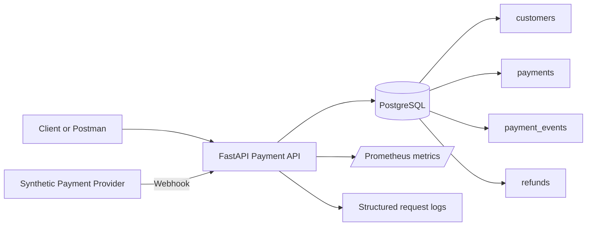

# Architecture

## Design choices

### Idempotency

Payment creation and refund creation require an `Idempotency-Key` header. Reusing the same key with the same logical request returns the existing resource. Reusing the key with a different payload returns HTTP 409.

### Event timeline

Every important state transition appends a row to `payment_events`. This creates an investigation trail that support engineers can join with the current payment state.

### Correlation ID

Every request receives an `X-Correlation-ID`. A caller may provide one, otherwise the API creates it. The value is returned in the response and included in request logs.

### Webhook deduplication

Provider webhooks include an external `event_id`. It is stored under a unique constraint so a provider retry does not execute the same state transition more than once.

### Observability

The API exposes `/health` and `/metrics`. Prometheus counters track request volume, latency, created payments and received webhook statuses.
